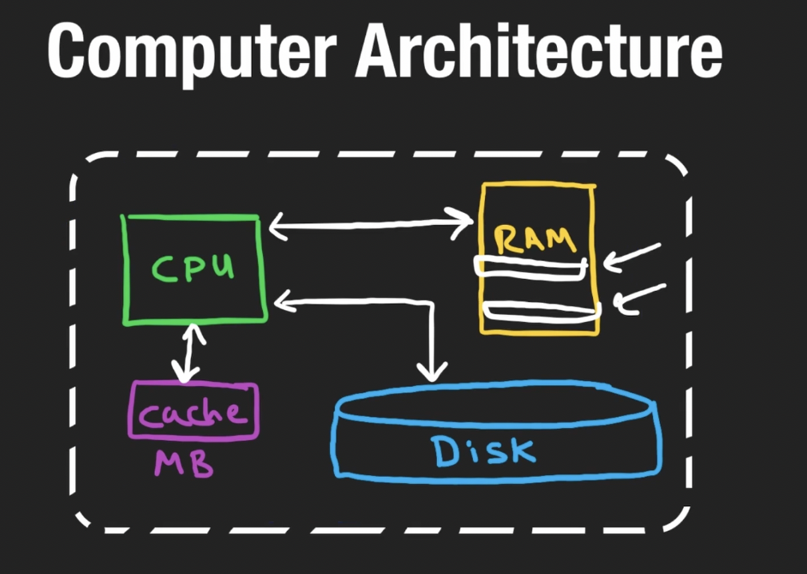
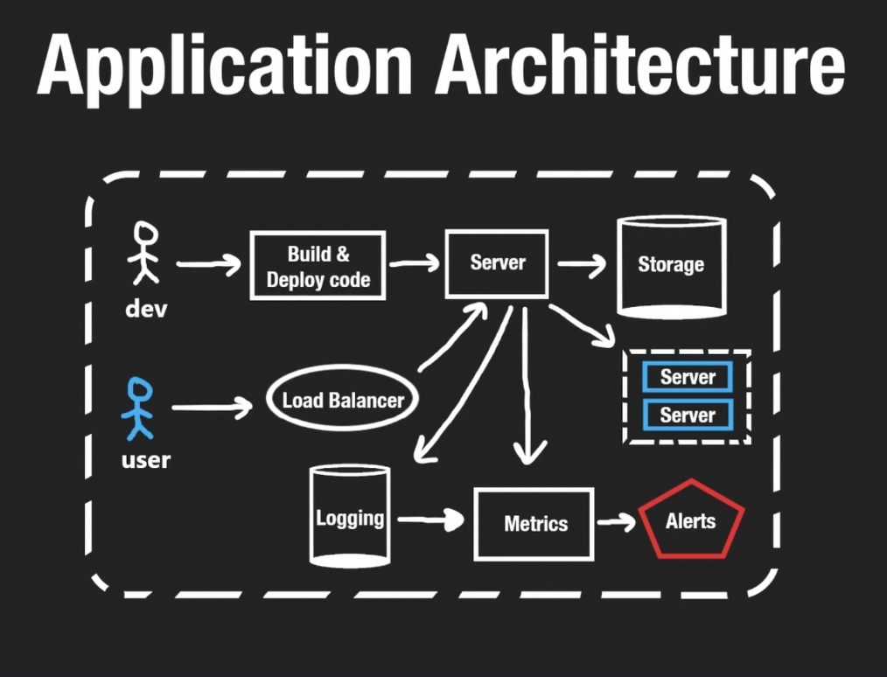
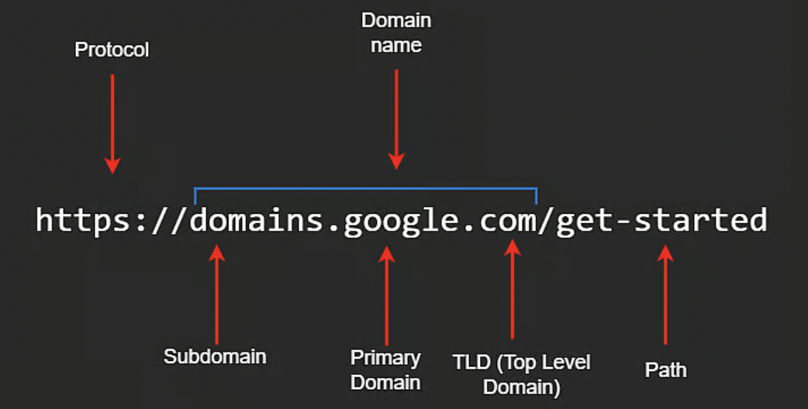

# NeetCode System Design for Beginners

# Background

## Computer Architecture  

Storage - or disk or storage
- Anything stored in disk is persisted. Meaning if the computer crashes, anything in the ssd is preserved.
- 1 Gb = 10^9 bytes in storage
- Byte - is a unit of digital information that commonly consists of 8 bits (either a 0 or 1). A byte is used to encode a single character of text. 

RAM - also know as memory. 
- Memory is measured in microseconds (1 second divided by a million). Reading and writing is a lot faster than from disk. 

CPU - is the brain of the computer
- I basically reads and writes information to RAM and Disk
- It can execute code
- CPUs also have a cache, typically MB in size. It helps speed up operations because they get completed in nanoseconds.

## Application Architecture

Prospective from a Dev

Dev -> Build & Deploy Code -> Server -> Storage

Vertical Scaling - e.g. Upgrading the server

Horizontal Scaling - e.g. Adding more servers
- If we have multiple requests coming into our server, how do we know which one to use?
  - Load Balancer - forwards the request to the server that has the least amount of traffic.
- Servers don't have to work in isolation, can communicate with other servers to handle other tasks.
  - E.g. Payments for an application would be handled by Stripe.

Logging - keeps track of everything happening in our code. Anything logged is time stamped
Metrics - keeps track of resources being used and if any part of the system is failing (e.g. a server is down). Can be visualized using graphs and charts.
- We can use logs to keep track of any requests that fail for users and then use metrics to make sense of that data collected form logs
- We can also have our metrics feed into an alert service, so that as a dev we can be notified if something is going wrong or if a metric has reached a specific threshold.

## Design Requirements

**System Design** - is about weighing trade-offs, system design is about analyzing what improvements can be made and what we have to sacrifice to make those improvements

**Design choices are very hard to correct later on!**

### Measurements of good design

**Availability** = uptime / uptime + downtime, discussed as a percentage "service was up 96% of the time"

- Ex. if service is up for 99% in a year = 3.65 days of server down, but is service is up 99.999% in a year = 5 mins of server down. 

SLO - Service Level Objective, to achieve 5 nines of availability (99.999%)

SLA (Service level agreement) = SLO + Extra stuff, if we don't reach this level of SLO we will give a partial refund

Reliability - Probability the system won't fail. Horizontal scaling would increase system reliability.

Fault Tolerance - Having a second server would increase fault tolerance. If one server crashes, the other one is still available

Redundancy - An extra server would be redundant, but it still helps to have it incase of failure. Having the second server in a different part of the world would reduce redundancy.

Throughput = amount of operations or data we can handle over some period of time. 
  - In the context of a server, when a user makes requests to a server, it is measured as requests per second.
  - For databases it would be QPS (Queries per second), very similar to server example
  - For a Data Pipeline it  would be bytes per second

Latency - amount of time for an operation to complete (E.g. the amount of time it takes a user to receive a response from the server)
  - Could be caused by network, the users physical location
  - CDNs can reduce latency
  - Also having servers in different parts of the world can help 

# Networking

## Networking Basics

### The Internet Protocol Basics

IP Address - is what unique identifier for a computer
  - IPv4
    - 32 bits 
    - e.g. 012.345.678.910
    - max value is 256.256.256.256 because it is 32 bits in size. if the digits went up to 999 then it wouldn't fit into 32 bits.
  - IPv6
    - 128 bits
    - e.g. 2001:0db8:85a3:0000:0000:8a2e:0370:7334

IP (Internet Protocol) - the rules for sending data over the internet

Packets are sent across and part of them include metadata aka the IP header. Includes things like where the packet comes from and where it needs to go.

TCP (Transmission Control Protocol) - allows us to send large amounts of data via the internet. Since the data will be sent over many packets, TCP is responsible for the accurate transmission of these packets. It ensures that packets arrive in the correct sequence.

- When sending over large amounts of data, we include a TCP header in the meta data 

HTTP is an application level protocol
TCP is a transport level protocol
IP is a network level protocol

Public vs. Private IP

 - If our computers are connected to a router, they don't need to have a public IP address. The router is the one doing the communicating with the internet so it will have the public address. 

 - Our LAN will give each of our machines in our home network a private IP address

 - IP Addresses can be static or dynamic

Ports 
  - are a channels of communication between machines
  - 16 bits (~65,000)
  - HTTP uses the 80 port as default
  - HTTPS uses 443 as default

  ## TCP and UDP

  TCP 
  - handles the order of the packets sent
  - Very reliable
  - If some packets don't arrive. TCP ensures that get resent so that the whole package arrives successfully
  - Called Retransmission of lost packets
  - It is a two-way connection
  - Established a 3-way handshake, ensures reliability but is expensive (a lot of overhead)
  - Web Sockets, HTTP, and Email use TCP

  UDP
  - Don't need a 3-way handshake
  - Lost packets do not get resent
  - Packets may arrive out of order and UDP does not correct them
  - A lot faster than TCP
  - Use in live streaming data (such as a video, online games, or DNS) and the packets would be frames

## DNS

DNS (Domain Name System) - the internet's phone book

"nslookup [domain name]" returns the IP address

ICCAN - non-profit that keeps track of all domain names

TDL - e.g. .com, .io, .uk

